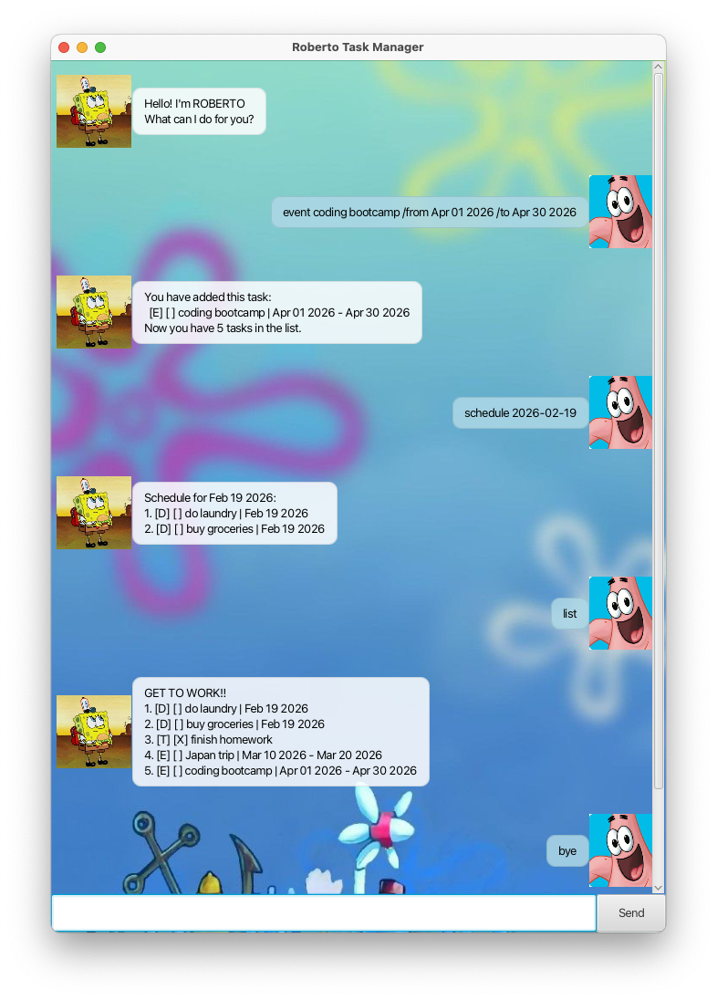

# Roberto User Guide



Roberto Task Manager provides you with the capabilities of tracking your tasks.

It allows you to keep track of 3 types of tasks: 
1. To-do tasks (no specified start and end dates)
2. Deadline tasks (specified end date)
3. Event tasks (specified start and end dates)

With several functionalities like finding specific tasks, and viewing tasks relevant to a specific date,
Roberto aims to give you a seamless, easy-to-use to-do list. 

## Adding to-do tasks 
Adds tasks without any date in mind. 
Provide a description of the task.

Example: `todo Go for a run`

Roberto will repeat your task to you to ensure it has been tracked, 
as well as the total number of tasks you have. 

```
You have added this task:
[T] [] Go for a run 
Now you have 6 tasks in the list.
```

## Adding deadline tasks
Adds tasks that need to be completed by a certain date.
Provide a description of the task, followed with '/by', then the deadline in 'Mmm dd yyyy' format 

Example: `deadline Finish CS2103T assignment /by Feb 20 2026`

Roberto will repeat your task to you to ensure it has been tracked,
as well as the total number of tasks you have.

```
You have added this task:
[D] [] Finish CS2103T assignment | Feb 20 2026
Now you have 7 tasks in the list.
```

## Adding event tasks
Adds tasks that take place between a range of dates.
Provide a description of the task, followed with '/from', then the start date in 'Mmm dd yyyy' format,
then the end date in 'Mmm dd yyyy' format. 

Example: `event Coding bootcamp /from Jan 01 2026 /to Jan 30 2026`

Roberto will repeat your task to you to ensure it has been tracked,
as well as the total number of tasks you have.

```
You have added this task:
[E] [] Coding bootcamp | Jan 01 2026 - Jan 30 2026
Now you have 8 tasks in the list.
```

## View full tasklist
Displays tasks you have on your list, with their task types, whether they are marked, and their dates.

Example: `list`

Roberto will display your current tasklist.

```
[D] [ ] Do laundry | Feb 19 2026
[D] [ ] Buy groceries | Feb 19 2026
[T] [X] Finish homework
[E] [ ] Japan trip | Mar 10 2026 - Mar 20 2026
[T] [ ] Go for a run
[D] [ ] Finish CS2103T assignment | Feb 20 2026
[E] [ ] Coding bootcamp | Jan 01 2026 - Jan 30 2026
```

## Mark/Unmark tasks
Adds/removes an 'X' from the task, either marking it as completed, or unmarking it to show it is uncompleted. 
Specify the task number you want to mark/unmark.

Example 1: `mark 6`

Roberto will add an 'X' to the 6th task in the list. 

```
Nice! I've marked this task as done:
[D] [X] Finish CS2103T assignment | Feb 20 2026
```

Example 2: `unmark 3`

Roberto will remove the 'X' from the 3rd task in the list.

```
OK, I've marked this task as not done yet:
[T] [ ] Finish homework
```

## Deleting tasks 
Removes a task from the list. Specify the task number you want to delete.

Example: `delete 3`

Roberto will display your current tasklist.

```
Noted. I've removed this task: 
[T] [ ] Finish homework
Now you have 6 tasks in the list.
```

## Finding tasks
Finds tasks with the specified keyword. 

Example: `find laundry`

Roberto will display tasks with that keyword.

```
Here are the matching tasks in your list: 
1. [D] [ ] Do laundry | Feb 19 2026
```

## Finding tasks on a date
Lists the tasks that fall on a specific date. 
Date must be provided in YYYY-MM-DD format. 

Example: `schedule 2026-02-19`

Roberto will display tasks that include that date.

```
Schedule for Feb 19 2026:
[D] [ ] Do laundry | Feb 19 2026
[D] [ ] Buy groceries | Feb 19 2026
```
---
## Command Summary 

| Action               | Command                                                 |
|----------------------|---------------------------------------------------------|
| Add to-do task       | todo Go for a run                                       |
| Add deadline task    | deadline Finish assignment /by Feb 20 2026              |
| Add event task       | event Coding bootcamp /from Jan 01 2026 /to Jan 30 2026 |
| View tasklist        | list                                                    |
| Mark task            | mark 7                                                  |
| Unmark task          | unmark 5                                                |
| Delete task          | delete 4                                                |
| Find keyword in task | find groceries                                          |
| Find tasks on a date | schedule 2026-12-31                                     |


